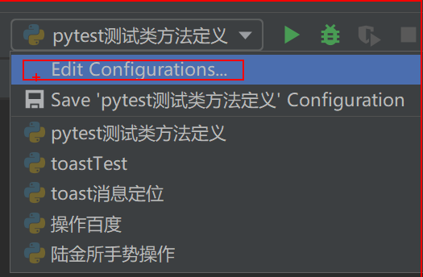
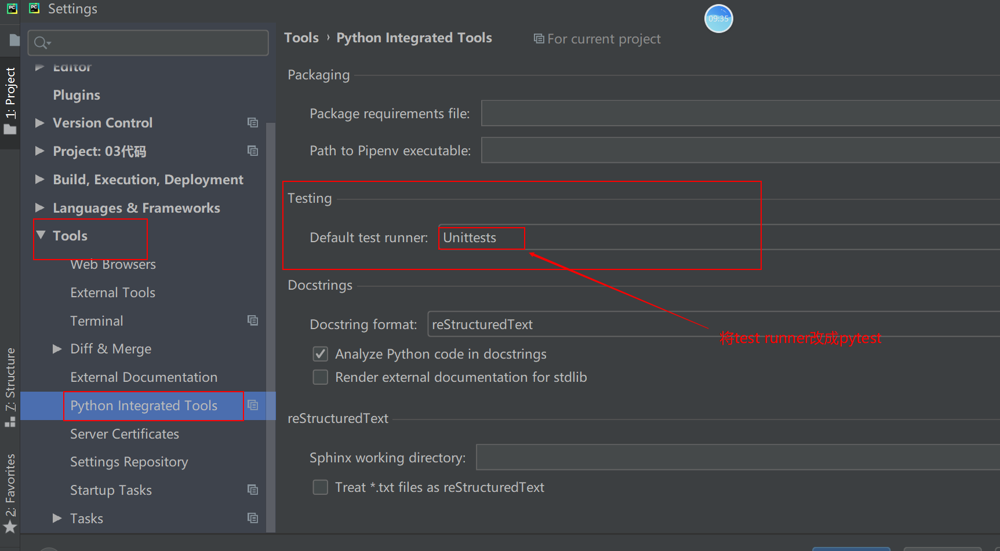

## 一、pytest测试框架

特点:

1、非常容易上手，入门简单，文档丰富，文档中有很多参考实例

2、支持简单的单元测试和复杂的功能测试

3、支持参数化

4、执行测试用例过程中，支持跳过操作

5、支持重复执行失败的case

6、支持运行由Nose，unittest编写的测试case

7、pytest支持很多第三方插件

8、方便的和持续集成工具集成

### 1、pytest介绍及安装

* pytest安装
  * 在线安装  pip install pytest
  * 离线安装方式   下载pytest离线安装包，并解压，然后在DOS下进入到解压的目录，然后执行  python setup.py install
  * pycharm
* 判断是否安装成功：
  * pip show  pytest
  * pycharm

### 2、pytest类定义及方法定义及运行

* pytest测试类的定义：类名必须是以Test开头
* pytest测试方法的定义：方法名必须是以test开头
* 执行：
  * 在pycharm中右击方法名或者类名可以直接执行对应测试类或者测试方法






​		

​	第二种运行方式:  通过pytest  -s -v 测试文件名称    (-s  输出的用例输出的信息， -v输出的是执行的用例的类名以及方法名)

```python
import pytest


def add(x, y):
    return x+y


class TestADD:  # 定义的类名必须是以Test开头
    def test_add_01(self):  # 定义的测试方法必须是以test开头
        result = add(1, 2)
        print(result)

    def test_add_02(self):
        result = add(2, 2)
        print(result)


```


### 3、pytest 断言

* pytest里面的断言方法就只有一个

  assert 表达式  

  ```python
  class TestADD:  # 定义的类名必须是以Test开头
      def test_add_01(self):  # 定义的测试方法必须是以test开头
          result = add(1, 2)
          print(result)
          # assert result == 3    判断相等
          # assert result != 4    判断不相等
          # assert result    # 判断为True
          #assert False        # 判断为False
          # assert "a" in "abc" # 判断包含
          # assert "a" not in "abc"  # 判断不包含
          # assert result is None
          assert result is not None
  ```

  

### 4、pytest 方法级别的fixture

* pytest方法级别的fixture是针对每个测试方法，在执行测试方法前会执行fixture初始化的操作，在执行完测试方法后，执行fixture销毁的操作。

  初始化的操作方法:   def setup(self):  方法来实现。

  销毁的操作方法: def teardown(self): 方法来实现。

  ```python
  import time
  
  
  def add(x, y):
      return x+y
  
  
  class TestAdd:
  
      def setup(self):
          print("测试用例开始执行时间:", time.strftime("%Y-%m-%D %H:%M:%S"))
  
      def test_add_01(self):
          result = add(1, 2)
          assert result == 3
  
      def test_add_02(self):
          result = add(2, 2)
          assert result == 4
  
      def teardown(self):
          print("测试用例结束时间:", time.strftime("
  ```

  

### 5、pytest类级别的fixture

* pytest 类级别的fixture针对每个测试类的初始化和销毁的操作，可以放在以下两个方法中

  * 类级别初始化的方法:   def setup_class(self):    

  * 类级别销毁的方法:  def teardown_class(slef):

    方法名称固定，不能修改。


fixture的方法必须写在测试类当中，不能写在测试类外面。

### 6、pytest配置文件

pytest的配置文件有固定的三个名称: pytest.ini  tox.ini    setup.cfg   这三个配置文件是放在项目的根目录下。

```
[pytest]   #  标识当前配置文件是pytest的配置文件
addopts = -s -v  # 标识pytest执行时增加的参数
testpaths = ./scripts  # 匹配搜索的目录
python_files = test_*.py # 匹配测试文件
python_classes = Test*  # 匹配测试类
python_functions = test_* # 匹配测试方法
```


## 二、pytest常用插件

### 1、控制用例执行顺序

* unittest测试用例执行顺序是根据测试方法名称的assicc码值的大小来的，值越小排在前面(a-z)

* pytest 正常情况下是根据测试方法的从上到下的顺序来执行

  可以通过 pytest-ordering 插件来控制pytest测试方法执行的顺序。

* 安装:

  * 在线安装：  pip install pytest-ordering
  * 离线安装: 下载对应的离线安装包，解压后，并进入到对应的目录，执行 python setup.py install
  * pycharm

* 使用

  @pytest.mark.run(order=x)   # x 表示的是整数，（既可以是负数也可以是正数）

  * 全为负数或者正数时，值越小，优先级越高

  * 既有正数，又有负数，那么正数优先级高  

  * 没有确定执行顺序的用例优先于负数

  * ```python
    @pytest.mark.last    # 设置用例最后执行
    ```

### 2、失败重试

* pytest-rerunfailures 安装

  * 在线安装
  * 离线安装
  * pycharm

* 使用

  在addopts参数行中增加对应的参数项:  --reruns 3

  当重复执行成功时，就不会再重复执行。

  

---

## 三、 pytest高级用法

### 1、跳过

@pytest.mark.skipif(condition, reason=None)

condition 表示是跳过的条件

<font color=red>这里面reason参数名称必填。</font>

@pytest.mark.skip(reason=None)

reason表示的是跳过的原因

可以在测试类和测试方法上使用

```python
import pytest


def add(x, y):
    return x+y

version = 21

class TestAdd:
    # @pytest.mark.last    # 设置用例最后执行
    def test_add_01(self):
        result = add(1, 2)
        assert 3 == result

    @pytest.mark.skipif(version > 20, reason="大于2.0的版本不需要再执行此用例")
    # @pytest.mark.skip("版本已更新，不需要再进行测试")
    @pytest.mark.run(order=0)
    def test_add_02(self):
        result = add(2, 2)
        assert 4 == result

    @pytest.mark.run(order=-2)
    def test_add_03(self):
        result = add(3, 2)
        assert 5 == result

```


### 2、数据的参数化

* pytest参数化实现： @pytest.mark.parameterize(argnames,  argvalues)

  * argnames 表示是  参数名字，是一串字符， 多个参数之间由逗号隔开 "username,  password"

  * argvalues 表示的是参数化的数据   [("13700001111","123124"),("13800011111","123456")]

    argname的参数个数要与argvalues里面的测试数据的个数要相同，否则会报错。

```python
import pytest


def add(x, y):
    return x+y


class TestAdd:
    @pytest.mark.parametrize("x,y,expect", [(1, 2, 3), (2, 2, 4), (3, 2, 5)])
    def test_add_01(self, x, y, expect):
        result = add(x, y)
        assert expect == result
```

